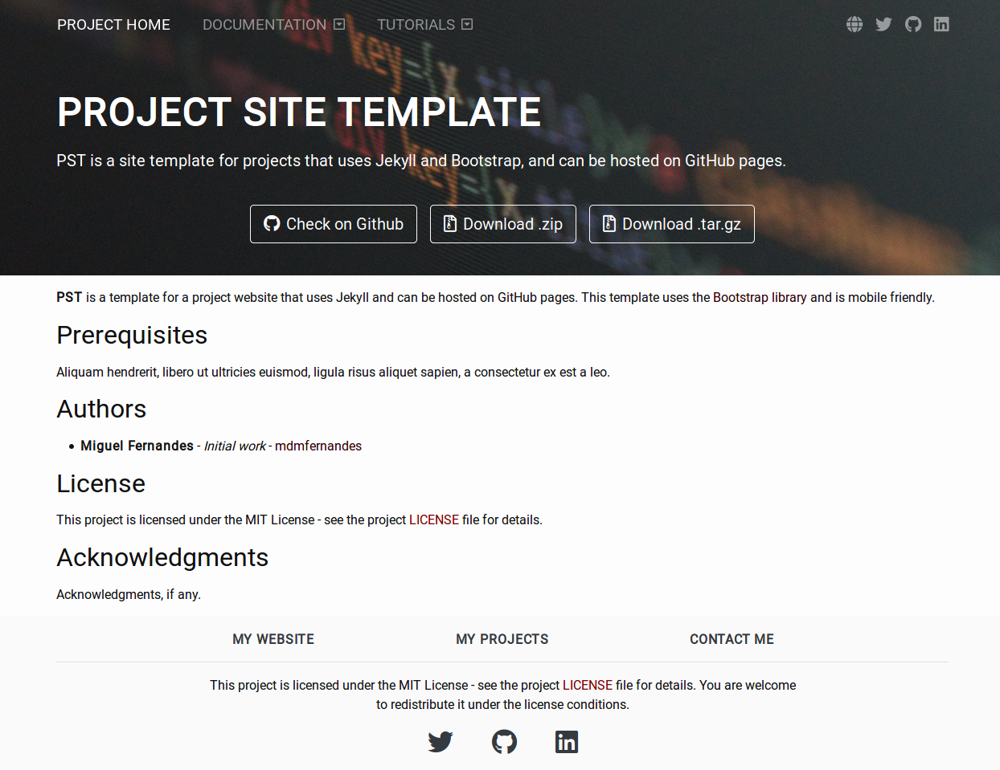

# project-site-template

 

A site template for projects that uses Jekyll and Bootstrap, and can be hosted on GitHub pages. This template is mobile friendly. You can try the website [here](https://mdmfernandes.github.io/project-site-template/).

## Setup

1. Clone the project.
2. Edit *_config.yml* with your data (more info on [Jekyll's website](https://jekyllrb.com/docs/configuration/)).
3. Modify the website content according to your needs.

## Test

If you want to test the website on your machine, follow these steps:

1. Install [Jekyll](https://jekyllrb.com/)
2. Run `bundle exec jekyll server` from the website root folder (where the *_config.yml* is)
3. Open it in your browser: `http://localhost:4000/project-site-template/`

## Main Contributors

* **Miguel Fernandes** - *Initial work* - [mdmfernandes](https://github.com/mdmfernandes)

## Contributing

1. Fork it!
2. Create your feature branch: `git checkout -b my-new-feature`
3. Commit your changes: `git commit -am 'Add some feature'`
4. Push to the branch: `git push origin my-new-feature`
5. Submit a pull request :D

## License

This project is licensed under the MIT License - see the project [LICENSE](https://github.com/mdmfernandes/project-site-template/blob/master/LICENSE) file for details.